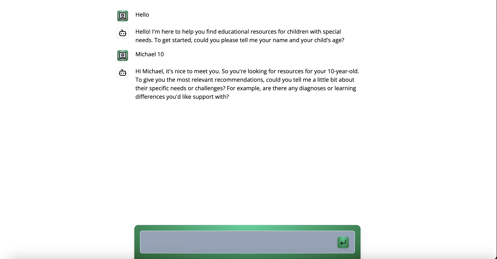

# Educational Resource Recommender Chatbot

This project implements an educational resource recommender agent chatbot. The chatbot is designed to assist users by recommending resources for children with special needs. It gathers the user's name and the child's age to provide tailored recommendations and general information about supporting children with special needs.

## Features

- **User Interaction**: The chatbot interacts with users to gather necessary details such as the user's name and the child's age.
- **Resource Recommendation**: Based on the provided details, the chatbot recommends appropriate resources for children with special needs.
- **General Information**: It also provides general information about various special needs and how to support children with those needs.
- **Limitations**: The chatbot clearly communicates that it is a demo and cannot perform tasks outside its defined scope.

## Code Overview

### Key Components

- **Message Handling**: The `sendMessage` function handles incoming user messages, updates the chat history, and generates responses using the AI model.
- **AI Configuration**: The AI model is configured using `createAI` with initial states and actions for message handling.
- **Streaming UI**: The `streamUI` function is used to generate dynamic responses while maintaining an engaging user interface with loading indicators.



## Getting Started

First, run the development server:

```bash
npm run dev
# or
yarn dev
# or
pnpm dev
# or
bun dev
```

Open [http://localhost:3000](http://localhost:3000) with your browser to see the result.

You can start editing the page by modifying `app/page.tsx`. The page auto-updates as you edit the file.

This project uses [`next/font`](https://nextjs.org/docs/basic-features/font-optimization) to automatically optimize and load Inter, a custom Google Font.

## Learn More

To learn more about Next.js, take a look at the following resources:

- [Next.js Documentation](https://nextjs.org/docs) - learn about Next.js features and API.
- [Learn Next.js](https://nextjs.org/learn) - an interactive Next.js tutorial.

You can check out [the Next.js GitHub repository](https://github.com/vercel/next.js/) - your feedback and contributions are welcome!

## Live Demo

Checkout live demo on Vercel [Educational Resource Recommender Chatbot](https://special-education-resource-recommender-chatbot.vercel.app) 
